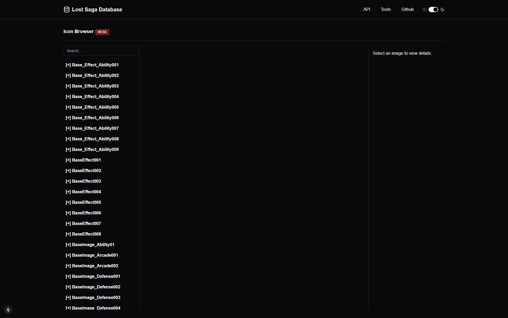
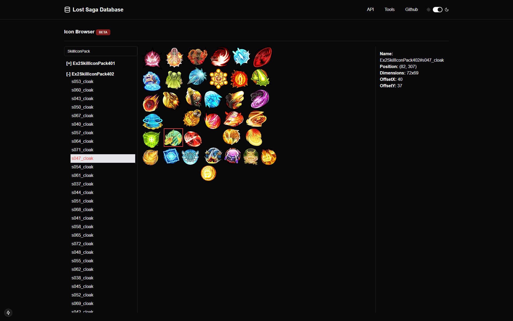

# Lost Saga Database + Web Tools
### Present by Lost Saga For Developer

## Preview

## Tech Stack
- NextJS 15
- TailwindCSS
- ShadCN

## Notes : 
- We encourage users to contribute improvements to this tool in the future.

## How to :
- Download NodeJS
- Clone this repository
- Open the clone repository witih your IDE (vscode/cursor/etc.)
- Run `npm install` to install dependencies
- Run `npm run dev` to run development mode.
- Run `npm run build` to build production mode
- Run `npm run start` to start production mode

## License
We used GPLv3 as core License